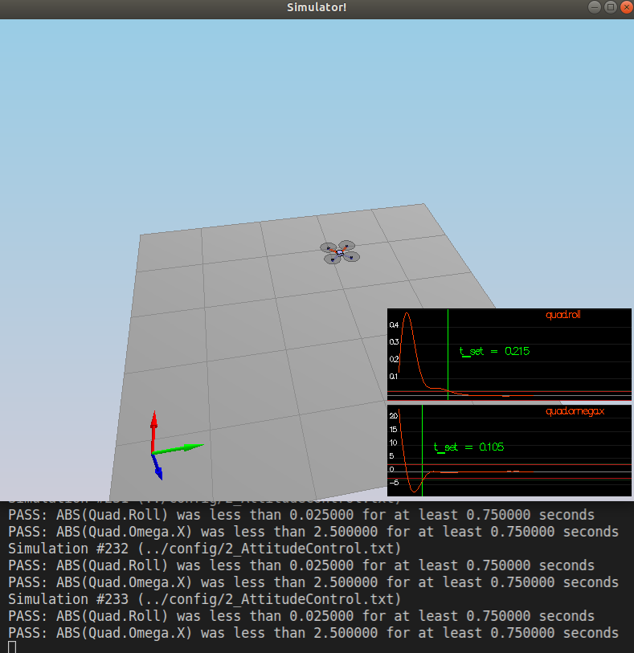
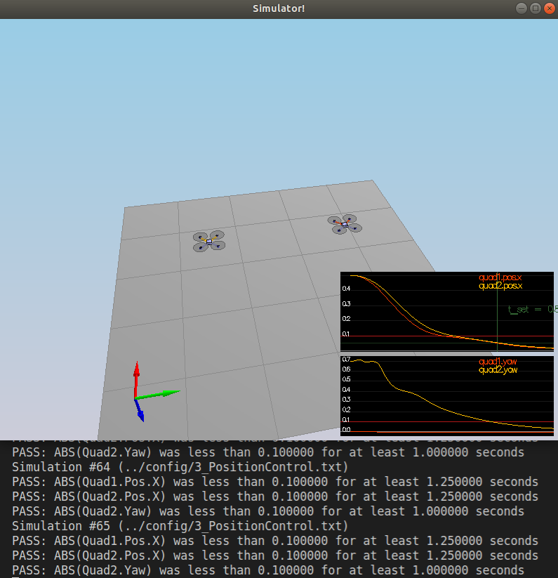
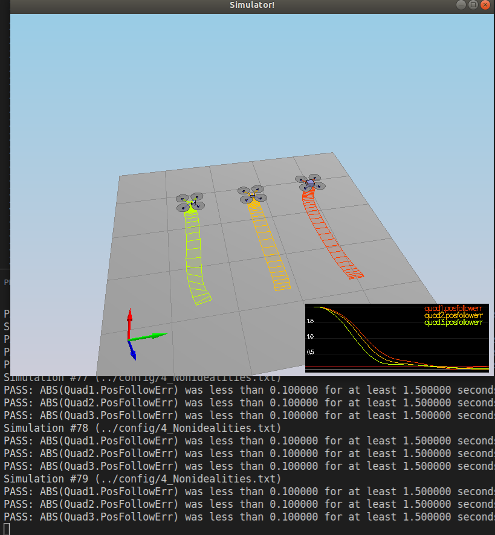
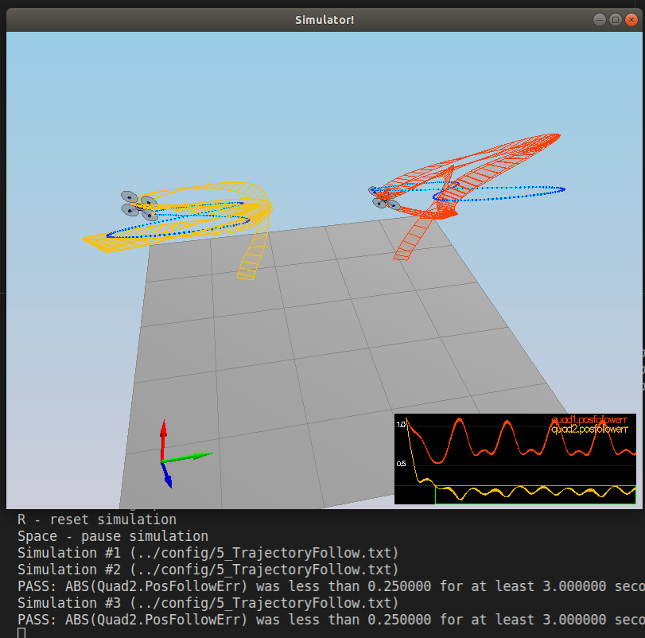

# Writeup building a 3D Quadrotor control #

The following explains how the project 3D Quadrotor control was implemented.

The project is structured to progress incrementaly by passing the test of different scenarios. 

### Body rate and roll/pitch control (scenario 2) ###

1. The function `GenerateMotorCommands()` was implemented based on the information provided in the knowledge area https://knowledge.udacity.com/questions/128899
   
2. `RollPitchControl()` perform the equations presented on the lesson https://classroom.udacity.com/nanodegrees/nd787/parts/cd1719/modules/23f55ba1-ec71-4842-893f-0a9b4ce7a7eb/lessons/27f0be59-d820-43df-912b-a0c9046f0230/concepts/87902e29-3f6b-4beb-b7fd-35c9af5dd816

The test passes as you can see on the picture

### Body rate and roll/pitch control (scenario 3) ###

1.  `AltitudeControl()` Implemented similar to the lesson exercise 
2.  `LateralPositionControl()` Implemented similar to the lesson exercise 
3.  `YawControl()` Inspired on https://knowledge.udacity.com/questions/624328

To get this work it was necessary to limit `b_x_desired` and `b_y_desired` to the `maxTiltAngle` in the function `RollPitchControl()`

### Non-idealities and robustness (scenario 4) ###

An integral controller part was added into `AltitudeControl()` simillar to the PID control excersise

Addapting P in `kpPQR` was necessary 

### Tracking trajectories (scenario 5) ###

It passes the tracking trajectories test!

